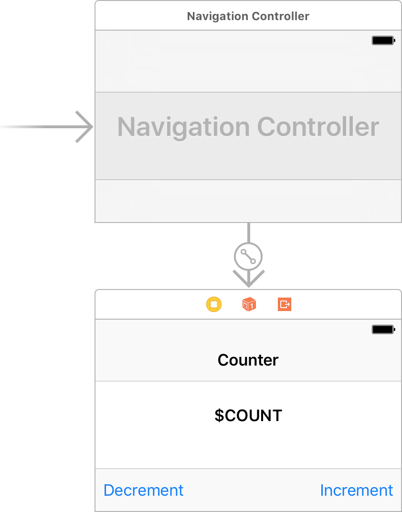

# The Elm Architecture for Swift

This is [The Elm Architecture](https://guide.elm-lang.org/architecture/) for [Swift](https://swift.org).

<a href="http://elm-lang.org"></a>
<a href="https://swift.org"></a>

Build status:

| `master` | `develop` |
| :------- | :-------- |
| [](https://dashboard.buddybuild.com/apps/583f5837a72f6501008044ab/build/latest) | [](https://dashboard.buddybuild.com/apps/583f5837a72f6501008044ab/build/latest) |

# About

_The Elm Architecture_ is a simple pattern for architecting apps. It is great for modularity, code reuse, and testing. Ultimately, it makes it easy to create complex apps that stay healthy as you refactor and add features.

# Example

Let's build a counter:


## Functional core

```swift
import Elm

struct Counter: Elm.Module {

    struct Flags {}

    enum Message {
        case increment
        case decrement
    }

    struct Model {
        var count: Int
    }

    struct View {
        let count: String
    }

    enum Command {}
    enum Failure {}

    static func start(with flags: Flags, perform: (Command) -> Void) throws -> Model {
        return .init(count: 0)
    }

    static func update(for message: Message, model: inout Model, perform: (Command) -> Void) throws {
        switch message {
        case .increment: model.count += 1
        case .decrement: model.count -= 1
        }
    }

    static func view(for model: Model) throws -> View {
        let count = String(model.count)
        return .init(count: count)
    }
    
}
```

## Imperative shell



```swift
import UIKit
import Elm

class CounterViewController: UIViewController, Elm.Delegate {

    typealias Module = Counter
    var program: Program<Module>!

    @IBOutlet var countLabel: UILabel!
    @IBOutlet var incrementButton: UIBarButtonItem!
    @IBOutlet var decrementButton: UIBarButtonItem!

    override func viewDidLoad() {
        super.viewDidLoad()
        program = Counter.makeProgram(delegate: self, flags: .init())
    }

    @IBAction func userDidTapIncrementButton() {
        program.dispatch(.increment)
    }

    @IBAction func userDidTapDecrementButton() {
        program.dispatch(.decrement)
    }

    func program(_ program: Program<Module>, didUpdate view: Module.View) {
        countLabel?.text = view.count
    }

    func program(_ program: Program<Module>, didEmit command: Module.Command) {
        fatalError()
    }
    
}
```

## Unit tests

```swift
import XCTest
import Elm

@testable import Counter

class CounterTests: XCTestCase, Elm.Tests {

    typealias Module = Counter
    let failureReporter = XCTFail

    func test() {
        let start = expectStart(with: .init())
        expect(start?.model.count, 0)
    }

    func testIncrement1() {
        let update = expectUpdate(for: .increment, model: .init(count: 1))
        expect(update?.model.count, 2)
    }

    func testIncrement2() {
        let update = expectUpdate(for: .increment, model: .init(count: 2))
        expect(update?.model.count, 3)
    }

    func testDecrement1() {
        let update = expectUpdate(for: .decrement, model: .init(count: -1))
        expect(update?.model.count, -2)
    }

    func testDecrement2() {
        let update = expectUpdate(for: .decrement, model: .init(count: -2))
        expect(update?.model.count, -3)
    }

    func testView1() {
        let view = expectView(for: .init(count: 1))
        expect(view?.count, "1")
    }

    func testView2() {
        let view = expectView(for: .init(count: 2))
        expect(view?.count, "2")
    }
    
}
```

# Installation

* Add `github "salutis/Elm" "master"` to `Cartfile`
* Run `carthage bootstrap`
* Drag `Carthage/Build/iOS/Elm.framework` to Xcode project
  * Targets:
    * `App`: Yes
    * `AppTests`: Yes
* Add _Copy Files_ build phase to both `App` and `AppTests` targets
  * Destination: `Frameworks`
  * Name: `Elm.framework`
* Add _Run Script_ build phase to both `App` and `AppTests` targets
  * Script: `carthage copy-frameworks`
  * Input files:`$(SRCROOT)/Carthage/Build/iOS/Elm.framework`
